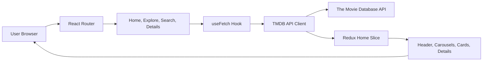

# movieflix

movieflix is a React + Vite OTT discovery app built around the full viewer journey: first launch, search, content rails, detail pages, trailers, recommendations, and responsive exploration for movies and TV shows.

## 2026 Upgrade Highlights

- Standardized the whole project brand as `movieflix`.
- Added a home-page viewer experience hub with a featured weekly trend, continue-watching style queue, and product health signals.
- Improved search UX with real form submission, trimmed queries, autofocus, and mobile search controls.
- Added keyboard accessibility to navigation tabs, content cards, carousel arrows, and poster interactions.
- Improved API hygiene with abortable requests and stricter error handling.
- Added semantic metadata for Vercel previews and shared links.

## Tech Stack

- React 18
- Vite
- Redux Toolkit
- React Router
- Axios
- SCSS
- TMDB API

## Local Setup

```bash
npm install
npm run dev
```

Create a `.env` file with:

```bash
VITE_APP_TMDB_TOKEN=your_tmdb_read_access_token
TMDB_TOKEN=your_tmdb_read_access_token
```

Production deployments use the `/api/tmdb` Vercel function so the app calls
TMDB through the same origin instead of relying on browser-to-TMDB requests.

## Data Flow Diagram



## Engineering Notes

- Shared `Img`, `Carousel`, `MovieCard`, `SwitchTabs`, and `ContentWrapper` components keep UI behavior reusable.
- `useFetch` cancels stale requests during route/filter changes to avoid unnecessary state updates.
- Content cards support mouse and keyboard entry points for better accessibility.
- The app is Vercel-ready through the standard Vite build command: `npm run build`.
